# VibeLayerAI Fullstack Architecture Document

**Status:** Build-Ready  
**Created:** 2025-09-06  
**Owner:** Architect (Winston)  
**Version:** 1.0  

---

## 1. Introduction

This document outlines the complete fullstack architecture for **VibeLayerAI**, including backend systems, frontend implementation, and their integration. It serves as the single source of truth for AI-driven development, ensuring consistency across the entire technology stack.

This unified approach combines what would traditionally be separate backend and frontend architecture documents, streamlining the development process for modern fullstack applications where these concerns are increasingly intertwined.

### Starter Template Assessment

**Project Type:** Greenfield with custom technology stack

After reviewing the comprehensive PRD and project structure, VibeLayerAI is built as a purpose-designed platform rather than from existing starter templates. The sophisticated requirements - real-time AI processing, cross-platform rendering, sub-500ms latency targets, and mobile-first approach - require custom architectural solutions beyond typical fullstack starters.

The monorepo structure with pnpm workspaces and Turbo aligns with modern fullstack practices while supporting the unique cross-platform needs.

### Change Log

| Date | Version | Description | Author |
|------|---------|-------------|---------|
| 2025-09-06 | 1.0 | Initial fullstack architecture document | Architect (Winston) |

---

## 2. High Level Architecture

### Technical Summary

VibeLayerAI employs a **real-time, event-driven microservices architecture** with native mobile apps and web PWA frontend, utilizing Google Cloud AI services for sub-500ms conversation-aware effect suggestions. The system combines WebSocket-based real-time communication, distributed AI processing pipeline, and cross-platform rendering engines (WebGL/Metal/OpenGL) to deliver professional live streaming effects. The architecture prioritizes mobile-first user experience while maintaining desktop feature parity, leveraging Convex for real-time data synchronization and multi-region deployment for global scalability. This design achieves the critical performance targets while providing enterprise-grade security for audio processing and creator privacy.

### Platform and Infrastructure Choice

**Platform:** Multi-cloud with Vercel + Google Cloud + Convex
**Key Services:** 
- Vercel (Frontend hosting, Edge functions, CDN)
- Google Cloud (STT v2, Gemini 2.5 Flash, Cloud Run)
- Convex (Real-time database, WebSocket scaling)
- Doppler (Secret management)

**Deployment Host and Regions:** Multi-region (US-East, US-West, EU-West) with intelligent creator-to-region routing

**Rationale:** This hybrid approach optimizes for the specific requirements:
- Vercel provides optimal Next.js deployment and global CDN for web app
- Google Cloud required for exclusive AI stack (STT + Gemini) with regional optimization
- Convex handles real-time WebSocket scaling and data synchronization better than traditional databases
- Multi-region deployment essential for sub-500ms global latency targets

### Repository Structure

**Structure:** Monorepo with workspace-based organization
**Monorepo Tool:** pnpm workspaces + Turbo for build orchestration
**Package Organization:** 
- `apps/` - Deployable applications (control-panel, mobile-ios, mobile-android, api-services)
- `packages/` - Shared libraries (effects-engine, protocol, brand-kit, config, ui-components)
- Clear separation enables independent deployment while maximizing code reuse

### High Level Architecture Diagram

```mermaid
graph TB
    %% Users
    MobileUser[📱 Mobile Creator]
    WebUser[💻 Desktop Creator]
    
    %% Frontend Layer
    subgraph "Frontend Applications"
        MobileApp[Native Mobile App<br/>iOS/Android]
        WebApp[Web PWA<br/>Next.js + React]
    end
    
    %% API Gateway
    subgraph "API Layer"
        Gateway[API Gateway<br/>Vercel Edge Functions]
        WSHub[WebSocket Hub<br/>Node.js/Fastify]
    end
    
    %% Core Services
    subgraph "Backend Services"
        AgentOrch[Agent Orchestra<br/>LangGraph + PydanticAI]
        EffectEngine[Effects Engine<br/>Rendering Service]
        BrandService[Brand Kit Service]
        Analytics[Analytics Service]
    end
    
    %% AI Services
    subgraph "Google Cloud AI"
        STT[Speech-to-Text v2<br/>Streaming + Diarization]
        Gemini[Gemini 2.5 Flash<br/>Intent Classification]
    end
    
    %% Data Layer
    subgraph "Data & Storage"
        Convex[(Convex DB<br/>Real-time Sync)]
        FileStore[File Storage<br/>Google Cloud Storage]
        Cache[Redis Cache<br/>Effect Assets]
    end
    
    %% External Integrations
    subgraph "Streaming Platforms"
        TikTok[TikTok Live API]
        Twitch[Twitch API]
        YouTube[YouTube Live API]
    end
    
    %% Connections
    MobileUser --> MobileApp
    WebUser --> WebApp
    
    MobileApp --> Gateway
    MobileApp --> WSHub
    WebApp --> Gateway
    WebApp --> WSHub
    
    Gateway --> AgentOrch
    WSHub --> AgentOrch
    
    AgentOrch --> STT
    AgentOrch --> Gemini
    AgentOrch --> EffectEngine
    AgentOrch --> BrandService
    
    EffectEngine --> Cache
    BrandService --> Convex
    Analytics --> Convex
    
    AgentOrch --> FileStore
    
    MobileApp -.-> TikTok
    WebApp -.-> Twitch
    WebApp -.-> YouTube
```



### Architectural Patterns

- **Event-Driven Microservices:** Asynchronous processing enables real-time responsiveness while maintaining service isolation - _Rationale:_ Critical for sub-500ms latency targets and independent scaling of AI processing components

- **CQRS (Command Query Responsibility Segregation):** Separate read/write models for real-time suggestions vs historical analytics - _Rationale:_ Optimizes for both real-time performance and complex analytics queries

- **Agent-Based AI Orchestration:** LangGraph coordinates STT → Intent → Suggestion pipeline with intelligent fallbacks - _Rationale:_ Provides deterministic AI processing flow while enabling complex multi-step reasoning

- **Cross-Platform Shared Components:** TypeScript interfaces and business logic shared across web/mobile - _Rationale:_ Ensures consistency while allowing platform-specific optimizations

- **WebSocket-First Communication:** Real-time bidirectional communication for suggestions and status - _Rationale:_ Essential for conversation-aware effects that feel instant and natural

- **Progressive Web App (PWA) Pattern:** Web app installable with offline capabilities for reliability - _Rationale:_ Bridges native app experience with web deployment flexibility

- **Multi-Tenant Brand System:** Brand Kit configurations isolated per creator with inheritance - _Rationale:_ Enables white-label customization while maintaining performance

- **Circuit Breaker Pattern:** Graceful degradation when AI services experience latency spikes - _Rationale:_ Maintains user experience during service disruptions

---

## 3. Tech Stack

The following represents the definitive technology selection for the entire VibeLayerAI project. All development must use these exact versions and technologies.

| Category | Technology | Version | Purpose | Rationale |
|----------|-----------|---------|---------|-----------|
| Frontend Language | TypeScript | 5.6.3 | Type-safe development across all platforms | Prevents runtime errors, enables better AI agent code generation |
| Frontend Framework | Next.js | 15.x | Web PWA with SSR/SSG capabilities | Best-in-class React framework with Vercel optimization |
| UI Component Library | shadcn/ui | Latest | Accessible, customizable component system | Reduces development time while maintaining brand flexibility |
| State Management | Zustand | 5.x | Lightweight state management | Simpler than Redux, perfect for real-time updates |
| Backend Language | Node.js | 20.x LTS | JavaScript ecosystem consistency | Enables code sharing and faster development |
| Backend Framework | Fastify | 5.x | High-performance WebSocket server | Superior performance for real-time communication |
| API Style | WebSocket + REST | - | Real-time + traditional API patterns | WebSocket for live updates, REST for CRUD operations |
| Database | Convex | Latest | Real-time database with live queries | Purpose-built for real-time applications |
| Cache | Redis | 7.x | High-performance caching | Essential for effect asset caching and session management |
| File Storage | Google Cloud Storage | - | Scalable file storage for effects | Integrates with Google AI stack |
| Authentication | BetterAuth | Latest | Modern auth with JWT + EdDSA | Security-first with replay prevention |
| Frontend Testing | Vitest | 2.x | Fast unit testing | Better performance than Jest |
| Backend Testing | Vitest + Supertest | 2.x | API testing framework | Consistent testing across frontend/backend |
| E2E Testing | Playwright | 1.x | Cross-platform testing | Best mobile and desktop testing support |
| Build Tool | Turbo | 2.x | Monorepo build orchestration | Optimal caching and parallel builds |
| Bundler | Next.js built-in | - | Webpack-based bundling | Integrated with Next.js optimizations |
| IaC Tool | Pulumi | 3.x | Infrastructure as Code | TypeScript-based infrastructure |
| CI/CD | GitHub Actions | - | Automated testing and deployment | Seamless integration with repository |
| Monitoring | Sentry | Latest | Error tracking and performance | Real-time error monitoring |
| Logging | Pino | 9.x | High-performance logging | Structured logging for debugging |
| CSS Framework | Tailwind CSS | 4.x | Utility-first styling | Rapid UI development with consistency |

---

## 4. Data Models

### Core Business Entities

The following data models represent the key business entities shared between frontend and backend systems:

### Creator

**Purpose:** Represents a livestream creator using the VibeLayerAI platform

**Key Attributes:**
- id: string - Unique creator identifier
- email: string - Contact and authentication
- displayName: string - Public creator name
- brandKit: BrandKit - Visual identity configuration
- subscriptionTier: SubscriptionTier - Feature access level
- platforms: PlatformConnection[] - Connected streaming platforms
- settings: CreatorSettings - Personal preferences

```typescript
interface Creator {
  id: string;
  email: string;
  displayName: string;
  brandKit: BrandKit;
  subscriptionTier: 'free' | 'creator' | 'professional' | 'enterprise';
  platforms: PlatformConnection[];
  settings: CreatorSettings;
  createdAt: Date;
  updatedAt: Date;
}
```

**Relationships:**
- One-to-One with BrandKit
- One-to-Many with StreamSession
- One-to-Many with Effect activations

### StreamSession

**Purpose:** Represents an active or completed livestream session with VibeLayerAI

**Key Attributes:**
- id: string - Unique session identifier
- creatorId: string - Session owner
- platform: Platform - Streaming platform used
- status: SessionStatus - Current session state
- effectsTriggered: EffectActivation[] - Effects used during session
- metrics: SessionMetrics - Performance and engagement data

```typescript
interface StreamSession {
  id: string;
  creatorId: string;
  platform: 'tiktok' | 'twitch' | 'youtube' | 'other';
  status: 'active' | 'paused' | 'ended';
  startTime: Date;
  endTime?: Date;
  effectsTriggered: EffectActivation[];
  metrics: SessionMetrics;
  aiProcessingStats: AIProcessingStats;
}
```

**Relationships:**
- Many-to-One with Creator
- One-to-Many with EffectActivation
- One-to-One with SessionMetrics

### Effect

**Purpose:** Represents a visual effect that can be triggered during streams

**Key Attributes:**
- id: string - Unique effect identifier
- name: string - Human-readable effect name
- category: EffectCategory - Grouping for organization
- intentTriggers: IntentType[] - AI intents that can trigger this effect
- renderConfig: RenderConfig - Platform-specific rendering parameters
- brandCompatibility: BrandScoring - Brand Kit compatibility rules

```typescript
interface Effect {
  id: string;
  name: string;
  category: 'celebration' | 'hype' | 'gratitude' | 'romance' | 'general';
  intentTriggers: IntentType[];
  renderConfig: {
    web: WebGLConfig;
    ios: MetalConfig;
    android: OpenGLConfig;
  };
  brandCompatibility: BrandScoring;
  thumbnailUrl: string;
  duration: number; // milliseconds
  performanceCost: 'low' | 'medium' | 'high';
}
```

**Relationships:**
- Many-to-Many with IntentType
- One-to-Many with EffectActivation

### BrandKit

**Purpose:** Creator's visual identity and brand consistency configuration

**Key Attributes:**
- id: string - Unique brand kit identifier
- creatorId: string - Owner reference
- colorPalette: ColorPalette - Primary and accent colors
- typography: TypographySettings - Font choices and sizing
- motionIntensity: MotionLevel - Animation intensity preference
- allowedCategories: EffectCategory[] - Permitted effect types

```typescript
interface BrandKit {
  id: string;
  creatorId: string;
  name: string;
  colorPalette: {
    primary: string;
    secondary: string;
    accent: string;
    background: string;
  };
  typography: {
    fontFamily: string;
    fontSize: 'small' | 'medium' | 'large';
    fontWeight: 'light' | 'normal' | 'bold';
  };
  motionIntensity: 1 | 2 | 3 | 4 | 5;
  allowedCategories: EffectCategory[];
  customEffectIds: string[];
}
```

**Relationships:**
- One-to-One with Creator
- Influences Effect compatibility scoring

---

## 5. API Specification

### WebSocket Real-Time API

The primary interface for real-time communication between clients and the AI processing pipeline:

```typescript
// WebSocket Message Protocol
interface WSMessage {
  type: 'suggestion' | 'activation' | 'status' | 'panic' | 'heartbeat';
  sessionId: string;
  timestamp: Date;
  payload: any;
}

// AI Suggestion Message
interface SuggestionMessage extends WSMessage {
  type: 'suggestion';
  payload: {
    effects: RankedEffect[];
    confidence: number;
    intentDetected: IntentType;
    speakerInfo: SpeakerInfo;
  };
}

// Effect Activation Message  
interface ActivationMessage extends WSMessage {
  type: 'activation';
  payload: {
    effectId: string;
    trigger: 'auto' | 'manual';
    renderParams: RenderParameters;
  };
}

// System Status Message
interface StatusMessage extends WSMessage {
  type: 'status';
  payload: {
    aiPipelineHealth: 'healthy' | 'degraded' | 'down';
    latency: LatencyMetrics;
    activeConnections: number;
  };
}
```

### REST API Endpoints

Standard REST endpoints for CRUD operations and configuration management:

```yaml
openapi: 3.0.0
info:
  title: VibeLayerAI REST API
  version: 1.0.0
  description: Configuration and management API for VibeLayerAI platform
servers:
  - url: https://api.vibelayer.ai/v1
    description: Production API

paths:
  /creators/profile:
    get:
      summary: Get creator profile
      security:
        - BearerAuth: []
      responses:
        '200':
          description: Creator profile data
          content:
            application/json:
              schema:
                $ref: '#/components/schemas/Creator'
    
  /brand-kits:
    post:
      summary: Create brand kit
      security:
        - BearerAuth: []
      requestBody:
        required: true
        content:
          application/json:
            schema:
              $ref: '#/components/schemas/BrandKit'
      responses:
        '201':
          description: Brand kit created
  
  /effects:
    get:
      summary: List available effects
      parameters:
        - name: category
          in: query
          schema:
            type: string
        - name: brandCompatible
          in: query
          schema:
            type: boolean
      responses:
        '200':
          description: List of effects
          content:
            application/json:
              schema:
                type: array
                items:
                  $ref: '#/components/schemas/Effect'

  /sessions:
    post:
      summary: Start streaming session
      security:
        - BearerAuth: []
      requestBody:
        required: true
        content:
          application/json:
            schema:
              type: object
              properties:
                platform:
                  type: string
                  enum: [tiktok, twitch, youtube]
                rtmpUrl:
                  type: string
      responses:
        '201':
          description: Session started
          content:
            application/json:
              schema:
                $ref: '#/components/schemas/StreamSession'

components:
  securitySchemes:
    BearerAuth:
      type: http
      scheme: bearer
      bearerFormat: JWT
```

---

## 6. Components

### Agent Orchestra (Core AI Processing)
**Responsibility:** Coordinates the real-time AI pipeline from speech input to effect suggestions using LangGraph orchestration

**Key Interfaces:**
- WebSocket message ingestion from clients
- Google Cloud STT v2 streaming integration
- Gemini 2.5 Flash intent classification
- Effect ranking and suggestion generation
- Real-time metrics collection and telemetry

**Dependencies:** Google Cloud STT, Gemini API, Effect Library, Brand Kit Service
**Technology Stack:** Python + LangGraph + PydanticAI, deployed on Google Cloud Run with auto-scaling

### Effects Engine (Cross-Platform Rendering)
**Responsibility:** Renders visual effects across web (WebGL) and native mobile (Metal/OpenGL) platforms with deterministic output

**Key Interfaces:**
- Effect activation API with render parameters
- Cross-platform rendering abstraction layer
- Performance monitoring and thermal management
- Asset caching and optimization

**Dependencies:** Effect Library, File Storage, Performance Monitor
**Technology Stack:** TypeScript core with platform-specific rendering engines (WebGL/Metal/OpenGL)

### WebSocket Hub (Real-Time Communication)
**Responsibility:** Manages real-time bidirectional communication between clients and backend services with scaling

**Key Interfaces:**
- Client connection management and authentication
- Message routing and protocol handling
- Connection scaling across multiple regions
- Heartbeat and reconnection logic

**Dependencies:** Authentication Service, Session Management, Load Balancer
**Technology Stack:** Node.js + Fastify + WebSocket, deployed on Convex for scaling

### Brand Kit Service (Visual Consistency)
**Responsibility:** Enforces creator brand consistency across all effect activations and provides customization interface

**Key Interfaces:**
- Brand Kit CRUD operations
- Effect compatibility scoring
- Real-time brand validation
- Template management and inheritance

**Dependencies:** Creator Service, Effect Library, File Storage
**Technology Stack:** Node.js microservice with Convex for real-time updates

### Mobile Native Apps (iOS/Android)
**Responsibility:** Provides native mobile interface with one-handed operation, RTMP streaming, and platform-specific optimizations

**Key Interfaces:**
- Native UI with ambidextrous design
- RTMP streaming integration where supported
- Audio processing and WebSocket communication
- Thermal management and battery optimization

**Dependencies:** Agent Orchestra (via WebSocket), Effects Engine, Platform APIs
**Technology Stack:** Swift/SwiftUI (iOS) + Metal, Kotlin/Compose (Android) + OpenGL/Vulkan

### Web Control Panel (Desktop Interface)
**Responsibility:** Comprehensive web-based interface for desktop streamers with full feature parity and professional controls

**Key Interfaces:**
- Live suggestion queue and manual effect library
- Comprehensive settings and brand kit management
- Analytics dashboard and ROI tracking
- OBS/streaming software integration

**Dependencies:** All backend services via REST + WebSocket
**Technology Stack:** Next.js 15 + React + TypeScript + shadcn/ui, deployed on Vercel

---

## 7. External APIs

### Google Cloud Speech-to-Text v2
- **Purpose:** Real-time speech transcription with speaker diarization and music filtering
- **Documentation:** https://cloud.google.com/speech-to-text/v2/docs
- **Base URL:** https://speech.googleapis.com/v2
- **Authentication:** Google Cloud Service Account with JSON key
- **Rate Limits:** 1000 requests/minute, streaming optimized

**Key Endpoints Used:**
- `POST /speech:streamingRecognize` - Real-time speech streaming
- `GET /operations/{operationId}` - Operation status monitoring

**Integration Notes:** Streaming connection maintained throughout session with automatic reconnection. Audio preprocessed to optimize for speech vs music distinction.

### Gemini 2.5 Flash API
- **Purpose:** Intent classification and conversational context understanding
- **Documentation:** https://ai.google.dev/gemini-api/docs
- **Base URL:** https://generativelanguage.googleapis.com/v1beta
- **Authentication:** Google API Key with quotas
- **Rate Limits:** 300 requests/minute with batching optimization

**Key Endpoints Used:**
- `POST /models/gemini-2.5-flash:generateContent` - Intent classification
- `GET /models/gemini-2.5-flash` - Model information and capabilities

**Integration Notes:** Optimized prompts for intent classification with confidence scoring. Caching strategy for similar conversation patterns to reduce costs.

### TikTok Live Studio API
- **Purpose:** RTMP streaming integration and overlay capabilities
- **Documentation:** https://developers.tiktok.com/doc/live-studio-api
- **Base URL:** https://open-api.tiktok.com
- **Authentication:** OAuth 2.0 with creator consent
- **Rate Limits:** 100 requests/minute per creator

**Key Endpoints Used:**
- `POST /live/stream/start` - Initiate live stream
- `GET /live/stream/status` - Stream health monitoring
- `POST /live/overlay/update` - Real-time overlay updates

**Integration Notes:** Limited availability requires fallback to web browser overlay method when API access unavailable.

---

## 7.1. AI Layer Architecture (Agent Orchestra)

The AI Layer represents the core intelligence system that transforms real-time audio into conversation-aware effect suggestions. This layer employs a sophisticated multi-agent architecture using LangGraph for orchestration and PydanticAI for agent definitions.

### AI Agent Architecture

**Agent Orchestra Pattern:**
The system uses a hierarchical agent architecture where specialized agents handle specific aspects of the AI pipeline, coordinated by a central orchestrator.

```typescript
// AI Agent State Management
interface AgentOrchestrationState {
  // Session Management
  session: {
    id: string;
    creatorId: string;
    platform: string;
    status: 'initializing' | 'active' | 'paused' | 'ended';
    startTime: Date;
    metadata: SessionMetadata;
  };

  // Audio Processing State
  audioProcessing: {
    isActive: boolean;
    inputLevel: number;
    speakerInfo: SpeakerInfo[];
    backgroundMusicDetected: boolean;
    processingLatency: LatencyMetrics;
  };

  // Intent Classification State
  intentClassification: {
    currentTranscript: string;
    previousTranscripts: string[];
    detectedIntents: ClassifiedIntent[];
    confidenceScores: number[];
    processingTime: number;
  };

  // Effect Suggestion State
  effectSuggestion: {
    rankedEffects: RankedEffect[];
    brandFiltering: BrandFilterResult;
    cooldownStates: CooldownState[];
    suggestionHistory: EffectSuggestion[];
    generationLatency: number;
  };

  // System Health State
  systemHealth: {
    sttServiceHealth: HealthStatus;
    geminiServiceHealth: HealthStatus;
    overallLatency: LatencyMetrics;
    errorRates: ErrorRateMetrics;
    activeConnections: number;
  };
}
```

### Core AI Agents

#### 1. Audio Processing Agent (STT Coordinator)
**Responsibility:** Manages Google Cloud STT v2 streaming connection and audio preprocessing

```python
# PydanticAI Agent Definition
from pydantic_ai import Agent, RunContext
from typing import Dict, List, Optional

class AudioProcessingAgent(Agent):
    """Manages real-time audio processing and speech-to-text conversion"""
    
    async def process_audio_stream(
        self,
        audio_chunk: bytes,
        context: RunContext[AgentOrchestrationState]
    ) -> AudioProcessingResult:
        """
        Process incoming audio chunk and return STT results
        
        Features:
        - Voice Activity Detection (VAD)
        - Speaker diarization
        - Music/speech separation
        - Quality assessment
        """
        
        # Voice activity detection
        has_speech = await self._detect_voice_activity(audio_chunk)
        if not has_speech:
            return AudioProcessingResult(
                transcript="",
                confidence=0.0,
                speaker_info=None,
                processing_time=0
            )
        
        # Music detection and filtering
        music_detected = await self._detect_background_music(audio_chunk)
        if music_detected:
            audio_chunk = await self._filter_music(audio_chunk)
        
        # Send to Google STT
        stt_result = await self._process_with_stt(audio_chunk)
        
        # Update state
        context.deps.update_audio_state({
            'isActive': True,
            'backgroundMusicDetected': music_detected,
            'processingLatency': stt_result.processing_time
        })
        
        return stt_result

    async def _process_with_stt(self, audio_chunk: bytes) -> STTResult:
        """Process audio with Google Cloud STT v2"""
        # Implementation details for STT integration
        pass
```

#### 2. Intent Classification Agent (Gemini Coordinator)
**Responsibility:** Analyzes conversation context and classifies speaker intent

```python
class IntentClassificationAgent(Agent):
    """Analyzes conversation context for intent classification"""
    
    async def classify_intent(
        self,
        transcript: str,
        speaker_info: SpeakerInfo,
        context: RunContext[AgentOrchestrationState]
    ) -> IntentClassificationResult:
        """
        Classify conversational intent using Gemini 2.5 Flash
        
        Intent Categories:
        - celebration: Achievement, success, victory
        - hype: Excitement, energy, anticipation
        - gratitude: Thanks, appreciation, acknowledgment
        - romance: Affection, love, intimate moments
        - general: Default category for unclear intents
        """
        
        # Build context window from recent transcripts
        conversation_context = self._build_context_window(
            transcript, 
            context.deps.intentClassification.previousTranscripts
        )
        
        # Create optimized prompt for Gemini
        classification_prompt = self._create_classification_prompt(
            conversation_context,
            speaker_info
        )
        
        # Call Gemini API
        gemini_result = await self._classify_with_gemini(classification_prompt)
        
        # Validate and score result
        validated_result = self._validate_classification(gemini_result)
        
        # Update state
        context.deps.update_intent_state({
            'currentTranscript': transcript,
            'detectedIntents': [validated_result],
            'confidenceScores': [validated_result.confidence],
            'processingTime': validated_result.processing_time
        })
        
        return validated_result

    def _create_classification_prompt(
        self, 
        context: str, 
        speaker_info: SpeakerInfo
    ) -> str:
        """Create optimized prompt for intent classification"""
        return f"""
        Analyze this live stream conversation for emotional intent:
        
        Context: {context}
        Speaker: {"Host" if speaker_info.is_host else "Guest"}
        
        Classify the primary intent (respond with JSON):
        {{
            "intent": "celebration|hype|gratitude|romance|general",
            "confidence": 0.0-1.0,
            "reasoning": "brief explanation",
            "trigger_worthy": boolean
        }}
        
        Focus on genuine emotional moments that would benefit from visual effects.
        """
```

#### 3. Effect Suggestion Agent (Ranking Coordinator)
**Responsibility:** Generates and ranks effect suggestions based on intent and brand settings

```python
class EffectSuggestionAgent(Agent):
    """Generates ranked effect suggestions based on classified intent"""
    
    async def generate_suggestions(
        self,
        classified_intent: IntentClassificationResult,
        context: RunContext[AgentOrchestrationState]
    ) -> EffectSuggestionResult:
        """
        Generate and rank effect suggestions
        
        Ranking Factors:
        1. Intent relevance (40%)
        2. Brand compatibility (30%)
        3. Cooldown status (15%)
        4. Diversity factor (10%)
        5. Performance cost (5%)
        """
        
        # Get applicable effects for intent
        candidate_effects = await self._get_effects_by_intent(
            classified_intent.intent
        )
        
        # Apply brand filtering
        brand_compatible_effects = await self._apply_brand_filtering(
            candidate_effects,
            context.deps.session.creatorId
        )
        
        # Check cooldown states
        available_effects = self._filter_by_cooldown(
            brand_compatible_effects,
            context.deps.effectSuggestion.cooldownStates
        )
        
        # Rank effects using weighted algorithm
        ranked_effects = self._rank_effects(
            available_effects,
            classified_intent,
            context.deps.effectSuggestion.suggestionHistory
        )
        
        # Apply diversity filtering to prevent repetition
        diverse_suggestions = self._apply_diversity_filter(
            ranked_effects,
            max_suggestions=3
        )
        
        # Update state
        context.deps.update_suggestion_state({
            'rankedEffects': diverse_suggestions,
            'generationLatency': time.time() - start_time
        })
        
        return EffectSuggestionResult(
            suggestions=diverse_suggestions,
            intent_source=classified_intent,
            generation_time=time.time() - start_time
        )

    def _rank_effects(
        self,
        effects: List[Effect],
        intent: IntentClassificationResult,
        history: List[EffectSuggestion]
    ) -> List[RankedEffect]:
        """Multi-factor ranking algorithm for effects"""
        
        scored_effects = []
        for effect in effects:
            # Intent relevance scoring
            intent_score = self._calculate_intent_relevance(effect, intent)
            
            # Brand compatibility scoring
            brand_score = self._calculate_brand_compatibility(effect)
            
            # Diversity scoring (penalize recent usage)
            diversity_score = self._calculate_diversity_score(effect, history)
            
            # Performance scoring (favor low-cost effects on mobile)
            performance_score = self._calculate_performance_score(effect)
            
            # Weighted final score
            final_score = (
                intent_score * 0.40 +
                brand_score * 0.30 +
                diversity_score * 0.15 +
                performance_score * 0.15
            )
            
            scored_effects.append(RankedEffect(
                effect=effect,
                score=final_score,
                intent_relevance=intent_score,
                brand_compatibility=brand_score
            ))
        
        return sorted(scored_effects, key=lambda x: x.score, reverse=True)
```

#### 4. System Health Monitor Agent
**Responsibility:** Monitors system health and manages fallback strategies

```python
class SystemHealthAgent(Agent):
    """Monitors AI pipeline health and manages fallbacks"""
    
    async def monitor_system_health(
        self,
        context: RunContext[AgentOrchestrationState]
    ) -> SystemHealthResult:
        """
        Monitor health of all AI components
        
        Health Checks:
        - Google STT service availability and latency
        - Gemini API service availability and quota
        - Overall pipeline latency
        - Error rate monitoring
        - Connection quality assessment
        """
        
        # Check STT service health
        stt_health = await self._check_stt_health()
        
        # Check Gemini service health
        gemini_health = await self._check_gemini_health()
        
        # Calculate overall latency
        overall_latency = self._calculate_pipeline_latency(context)
        
        # Check error rates
        error_rates = self._calculate_error_rates(context)
        
        # Determine overall health status
        overall_health = self._determine_overall_health(
            stt_health, gemini_health, overall_latency, error_rates
        )
        
        # Trigger fallbacks if necessary
        if overall_health.status == 'degraded':
            await self._trigger_fallback_mode(context)
        
        return SystemHealthResult(
            stt_health=stt_health,
            gemini_health=gemini_health,
            overall_latency=overall_latency,
            error_rates=error_rates,
            status=overall_health.status
        )

    async def _trigger_fallback_mode(
        self, 
        context: RunContext[AgentOrchestrationState]
    ):
        """Implement fallback strategies during service degradation"""
        
        # Fallback strategies:
        # 1. Increase caching for similar conversation patterns
        # 2. Reduce suggestion frequency to decrease API load
        # 3. Use simpler intent classification rules
        # 4. Prioritize manual effect library over AI suggestions
        pass
```

### LangGraph Orchestration

The agents are orchestrated using LangGraph to create a robust, fault-tolerant pipeline:

```python
from langgraph.graph import StateGraph, END

def create_ai_pipeline_graph() -> StateGraph:
    """Create the main AI processing pipeline using LangGraph"""
    
    # Create state graph
    workflow = StateGraph(AgentOrchestrationState)
    
    # Add agents as nodes
    workflow.add_node("audio_processing", AudioProcessingAgent())
    workflow.add_node("intent_classification", IntentClassificationAgent())
    workflow.add_node("effect_suggestion", EffectSuggestionAgent())
    workflow.add_node("health_monitor", SystemHealthAgent())
    
    # Define the processing flow
    workflow.add_edge("audio_processing", "intent_classification")
    workflow.add_edge("intent_classification", "effect_suggestion")
    workflow.add_edge("effect_suggestion", END)
    
    # Add conditional edges for error handling
    workflow.add_conditional_edges(
        "audio_processing",
        should_continue_processing,
        {
            True: "intent_classification",
            False: END
        }
    )
    
    # Add health monitoring as parallel process
    workflow.add_edge("health_monitor", END)
    
    # Set entry point
    workflow.set_entry_point("audio_processing")
    
    return workflow.compile()

def should_continue_processing(state: AgentOrchestrationState) -> bool:
    """Determine if processing should continue based on audio quality"""
    return (
        state.audioProcessing.isActive and
        len(state.intentClassification.currentTranscript.strip()) > 0
    )
```

### AI State Management

**State Persistence and Synchronization:**

```typescript
// AI State Store (Zustand)
interface AIState {
  // Agent Orchestration State
  orchestration: AgentOrchestrationState;
  
  // Real-time Updates
  updateAudioState: (update: Partial<AudioProcessingState>) => void;
  updateIntentState: (update: Partial<IntentClassificationState>) => void;
  updateSuggestionState: (update: Partial<EffectSuggestionState>) => void;
  updateHealthState: (update: Partial<SystemHealthState>) => void;
  
  // Action Handlers
  startProcessing: (sessionId: string) => Promise<void>;
  stopProcessing: () => Promise<void>;
  processAudioChunk: (audioChunk: ArrayBuffer) => Promise<void>;
  triggerManualSuggestion: (query: string) => Promise<void>;
  
  // Error Handling
  lastError: AIError | null;
  handleError: (error: AIError) => void;
  clearError: () => void;
  
  // Performance Metrics
  metrics: {
    avgLatency: number;
    successRate: number;
    suggestionsGenerated: number;
    effectsTriggered: number;
  };
  updateMetrics: (metrics: Partial<AIMetrics>) => void;
}

// AI State Store Implementation
export const useAIStore = create<AIState>((set, get) => ({
  orchestration: {
    session: null,
    audioProcessing: {
      isActive: false,
      inputLevel: 0,
      speakerInfo: [],
      backgroundMusicDetected: false,
      processingLatency: { p50: 0, p95: 0 }
    },
    intentClassification: {
      currentTranscript: '',
      previousTranscripts: [],
      detectedIntents: [],
      confidenceScores: [],
      processingTime: 0
    },
    effectSuggestion: {
      rankedEffects: [],
      brandFiltering: null,
      cooldownStates: [],
      suggestionHistory: [],
      generationLatency: 0
    },
    systemHealth: {
      sttServiceHealth: 'unknown',
      geminiServiceHealth: 'unknown',
      overallLatency: { p50: 0, p95: 0 },
      errorRates: { stt: 0, gemini: 0, overall: 0 },
      activeConnections: 0
    }
  },

  updateAudioState: (update) => set((state) => ({
    orchestration: {
      ...state.orchestration,
      audioProcessing: { ...state.orchestration.audioProcessing, ...update }
    }
  })),

  updateIntentState: (update) => set((state) => ({
    orchestration: {
      ...state.orchestration,
      intentClassification: { ...state.orchestration.intentClassification, ...update }
    }
  })),

  updateSuggestionState: (update) => set((state) => ({
    orchestration: {
      ...state.orchestration,
      effectSuggestion: { ...state.orchestration.effectSuggestion, ...update }
    }
  })),

  processAudioChunk: async (audioChunk: ArrayBuffer) => {
    const state = get();
    try {
      // Send to AI pipeline via WebSocket
      const result = await aiPipelineService.processAudio({
        sessionId: state.orchestration.session?.id,
        audioChunk,
        timestamp: Date.now()
      });
      
      // Update state based on results
      if (result.transcript) {
        state.updateIntentState({
          currentTranscript: result.transcript,
          processingTime: result.processingTime
        });
      }
      
      if (result.suggestions?.length > 0) {
        state.updateSuggestionState({
          rankedEffects: result.suggestions,
          generationLatency: result.suggestionLatency
        });
      }
      
    } catch (error) {
      state.handleError(error as AIError);
    }
  },

  // Additional methods...
}));
```

### AI Pipeline Integration

**WebSocket Integration for Real-time AI Processing:**

```typescript
// AI Pipeline WebSocket Service
class AIPipelineService {
  private ws: WebSocket | null = null;
  private messageQueue: AIMessage[] = [];
  
  async connect(sessionId: string): Promise<void> {
    this.ws = new WebSocket(`${WS_URL}/ai-pipeline`);
    
    this.ws.onopen = () => {
      this.authenticate(sessionId);
      this.processMessageQueue();
    };
    
    this.ws.onmessage = (event) => {
      const message = JSON.parse(event.data) as AIMessage;
      this.handleAIResponse(message);
    };
    
    this.ws.onerror = (error) => {
      logger.error('AI Pipeline WebSocket error', error);
      useAIStore.getState().handleError(new AIError('CONNECTION_ERROR', error.message));
    };
  }
  
  async processAudio(request: AudioProcessingRequest): Promise<void> {
    if (!this.ws || this.ws.readyState !== WebSocket.OPEN) {
      this.messageQueue.push({
        type: 'AUDIO_PROCESSING',
        payload: request
      });
      return;
    }
    
    this.ws.send(JSON.stringify({
      type: 'AUDIO_PROCESSING',
      payload: {
        ...request,
        audioChunk: Array.from(new Uint8Array(request.audioChunk))
      }
    }));
  }
  
  private handleAIResponse(message: AIMessage): void {
    const aiStore = useAIStore.getState();
    
    switch (message.type) {
      case 'AUDIO_PROCESSED':
        aiStore.updateAudioState(message.payload);
        break;
        
      case 'INTENT_CLASSIFIED':
        aiStore.updateIntentState(message.payload);
        break;
        
      case 'SUGGESTIONS_GENERATED':
        aiStore.updateSuggestionState(message.payload);
        // Notify UI components
        useSuggestionsStore.getState().updateSuggestions(message.payload.rankedEffects);
        break;
        
      case 'HEALTH_UPDATE':
        aiStore.updateHealthState(message.payload);
        break;
        
      case 'ERROR':
        aiStore.handleError(new AIError(message.payload.code, message.payload.message));
        break;
    }
  }
}
```

### Performance Optimization

**Caching and Optimization Strategies:**

```python
class AIOptimizationService:
    """Service for optimizing AI pipeline performance"""
    
    def __init__(self):
        self.intent_cache = TTLCache(maxsize=1000, ttl=300)  # 5 min TTL
        self.effect_cache = TTLCache(maxsize=500, ttl=600)   # 10 min TTL
        
    async def get_cached_intent(self, transcript_hash: str) -> Optional[IntentClassificationResult]:
        """Get cached intent classification for similar transcripts"""
        return self.intent_cache.get(transcript_hash)
    
    async def cache_intent_result(
        self, 
        transcript_hash: str, 
        result: IntentClassificationResult
    ):
        """Cache intent classification result"""
        self.intent_cache[transcript_hash] = result
    
    async def optimize_gemini_request(self, prompt: str) -> str:
        """Optimize Gemini API request to reduce token usage"""
        # Remove redundant words and optimize prompt structure
        optimized = self._compress_prompt(prompt)
        return optimized
    
    def _compress_prompt(self, prompt: str) -> str:
        """Compress prompt while maintaining classification accuracy"""
        # Implementation for prompt compression
        pass
```

This enhanced AI layer architecture provides:

1. **Multi-Agent Orchestration** using LangGraph and PydanticAI
2. **Comprehensive State Management** with Zustand stores
3. **Real-time Processing Pipeline** with WebSocket integration
4. **Performance Optimization** with caching and request optimization
5. **Health Monitoring** with fallback strategies
6. **Error Handling** with graceful degradation

The system is designed to achieve the critical sub-500ms latency targets while maintaining reliability and cost efficiency through intelligent caching and optimization strategies.

---

## 8. Core Workflows

### Real-Time Effect Suggestion Workflow


### Cross-Platform Effect Rendering Workflow


---

## 9. Database Schema

Based on Convex real-time database with TypeScript schema definitions:

```typescript
// Convex Schema Definition
import { defineSchema, defineTable } from "convex/server";
import { v } from "convex/values";

export default defineSchema({
  creators: defineTable({
    email: v.string(),
    displayName: v.string(),
    subscriptionTier: v.union(
      v.literal("free"),
      v.literal("creator"), 
      v.literal("professional"),
      v.literal("enterprise")
    ),
    settings: v.object({
      autoTriggerEnabled: v.boolean(),
      suggestionThreshold: v.number(),
      panicHotkeyEnabled: v.boolean(),
    }),
    platforms: v.array(v.object({
      platform: v.string(),
      connected: v.boolean(),
      apiKey: v.optional(v.string()),
    })),
  })
    .index("by_email", ["email"]),

  brandKits: defineTable({
    creatorId: v.id("creators"),
    name: v.string(),
    colorPalette: v.object({
      primary: v.string(),
      secondary: v.string(),
      accent: v.string(),
      background: v.string(),
    }),
    typography: v.object({
      fontFamily: v.string(),
      fontSize: v.union(v.literal("small"), v.literal("medium"), v.literal("large")),
      fontWeight: v.union(v.literal("light"), v.literal("normal"), v.literal("bold")),
    }),
    motionIntensity: v.union(
      v.literal(1), v.literal(2), v.literal(3), v.literal(4), v.literal(5)
    ),
    allowedCategories: v.array(v.string()),
  })
    .index("by_creator", ["creatorId"]),

  streamSessions: defineTable({
    creatorId: v.id("creators"),
    platform: v.union(
      v.literal("tiktok"),
      v.literal("twitch"),
      v.literal("youtube"),
      v.literal("other")
    ),
    status: v.union(
      v.literal("active"),
      v.literal("paused"),
      v.literal("ended")
    ),
    startTime: v.number(), // Unix timestamp
    endTime: v.optional(v.number()),
    metrics: v.object({
      effectsTriggered: v.number(),
      averageLatency: v.number(),
      totalViewers: v.optional(v.number()),
      revenueGenerated: v.optional(v.number()),
    }),
  })
    .index("by_creator", ["creatorId"])
    .index("by_status", ["status"]),

  effects: defineTable({
    name: v.string(),
    category: v.union(
      v.literal("celebration"),
      v.literal("hype"),
      v.literal("gratitude"),
      v.literal("romance"),
      v.literal("general")
    ),
    intentTriggers: v.array(v.string()),
    renderConfig: v.object({
      duration: v.number(),
      performanceCost: v.union(
        v.literal("low"),
        v.literal("medium"),
        v.literal("high")
      ),
    }),
    thumbnailUrl: v.string(),
    assetUrls: v.object({
      web: v.string(),
      ios: v.string(),
      android: v.string(),
    }),
  })
    .index("by_category", ["category"]),

  effectActivations: defineTable({
    sessionId: v.id("streamSessions"),
    effectId: v.id("effects"),
    trigger: v.union(v.literal("auto"), v.literal("manual")),
    timestamp: v.number(),
    intentDetected: v.optional(v.string()),
    confidence: v.optional(v.number()),
    renderLatency: v.number(),
  })
    .index("by_session", ["sessionId"])
    .index("by_timestamp", ["timestamp"]),
});
```

**Performance Optimizations:**
- Strategic indexing on frequently queried fields
- Real-time subscriptions for live data updates
- Automatic data synchronization across clients
- Built-in caching and edge distribution

---

## 10. Frontend Architecture

### Component Architecture

**Organization Pattern:** Atomic Design with domain-specific groupings

```
src/
├── components/
│   ├── atoms/           # Basic building blocks
│   │   ├── Button/
│   │   ├── Input/
│   │   └── Icon/
│   ├── molecules/       # Simple combinations
│   │   ├── EffectCard/
│   │   ├── SuggestionBadge/
│   │   └── BrandColorPicker/
│   ├── organisms/       # Complex UI sections  
│   │   ├── EffectLibrary/
│   │   ├── SuggestionQueue/
│   │   └── StreamControls/
│   └── templates/       # Page layouts
│       ├── DashboardLayout/
│       └── StreamingLayout/
├── hooks/               # Reusable React logic
│   ├── useWebSocket.ts
│   ├── useEffects.ts
│   └── useBrandKit.ts
└── services/           # API communication
    ├── api.ts
    ├── websocket.ts
    └── auth.ts
```

**Component Template:**
```typescript
// Standard component structure
interface ComponentProps {
  // Props definition with TypeScript
}

export const Component: React.FC<ComponentProps> = ({ prop1, prop2 }) => {
  // Hooks for state and effects
  const [state, setState] = useState();
  const { data, loading } = useCustomHook();

  // Event handlers
  const handleAction = useCallback(() => {
    // Action logic
  }, [dependencies]);

  // Render with accessibility
  return (
    <div role="region" aria-label="Component description">
      {/* Component JSX */}
    </div>
  );
};
```

### State Management Architecture

**State Structure with Zustand:**
```typescript
interface AppState {
  // Authentication state
  auth: {
    user: Creator | null;
    isAuthenticated: boolean;
    login: (credentials: LoginCredentials) => Promise<void>;
    logout: () => void;
  };
  
  // Real-time suggestions
  suggestions: {
    current: RankedEffect[];
    confidence: number;
    isLoading: boolean;
    clearSuggestions: () => void;
  };
  
  // Effect library
  effects: {
    library: Effect[];
    favorites: string[];
    searchTerm: string;
    selectedCategory: EffectCategory | null;
    toggleFavorite: (effectId: string) => void;
    setSearchTerm: (term: string) => void;
  };
  
  // Brand kit
  brandKit: {
    current: BrandKit | null;
    isEditing: boolean;
    updateColors: (colors: ColorPalette) => void;
    updateSettings: (settings: Partial<BrandKit>) => void;
  };
  
  // Stream session
  session: {
    current: StreamSession | null;
    status: SessionStatus;
    metrics: SessionMetrics;
    startSession: (platform: Platform) => Promise<void>;
    endSession: () => Promise<void>;
  };
}
```

**State Management Patterns:**
- Zustand stores for each major domain (auth, suggestions, effects, etc.)
- Immer integration for immutable state updates  
- Subscription patterns for real-time WebSocket data
- Persistence layer for offline functionality
- Optimistic updates for better UX

### Routing Architecture

**Route Organization (Next.js App Router):**
```
app/
├── (dashboard)/         # Dashboard group
│   ├── layout.tsx      # Dashboard-specific layout
│   ├── page.tsx        # Dashboard home
│   ├── effects/        # Effect library
│   ├── brand-kit/      # Brand customization
│   └── analytics/      # Performance analytics
├── (streaming)/        # Streaming interface group
│   ├── layout.tsx      # Minimal streaming layout
│   ├── mobile/         # Mobile-optimized interface
│   └── desktop/        # Desktop streaming controls
├── auth/               # Authentication flows
│   ├── login/
│   ├── register/
│   └── callback/       # OAuth callbacks
├── api/                # API routes
│   ├── auth/
│   ├── effects/
│   └── websocket/
└── globals.css         # Global styles
```

**Protected Route Pattern:**
```typescript
// Middleware for route protection
export function withAuth<T extends object>(Component: React.ComponentType<T>) {
  return function AuthenticatedComponent(props: T) {
    const { isAuthenticated, user } = useAuthStore();
    const router = useRouter();

    useEffect(() => {
      if (!isAuthenticated) {
        router.push('/auth/login');
      }
    }, [isAuthenticated, router]);

    if (!isAuthenticated || !user) {
      return <LoadingSpinner />;
    }

    return <Component {...props} />;
  };
}
```

### Frontend Services Layer

**API Client Setup:**
```typescript
// API client with authentication and error handling
class ApiClient {
  private baseUrl: string;
  private token: string | null = null;

  constructor(baseUrl: string) {
    this.baseUrl = baseUrl;
  }

  setToken(token: string) {
    this.token = token;
  }

  private async request<T>(
    endpoint: string,
    options: RequestInit = {}
  ): Promise<T> {
    const url = `${this.baseUrl}${endpoint}`;
    const headers = {
      'Content-Type': 'application/json',
      ...(this.token && { Authorization: `Bearer ${this.token}` }),
      ...options.headers,
    };

    const response = await fetch(url, { ...options, headers });
    
    if (!response.ok) {
      throw new ApiError(response.status, await response.json());
    }

    return response.json();
  }

  // CRUD methods
  async get<T>(endpoint: string): Promise<T> {
    return this.request<T>(endpoint);
  }

  async post<T>(endpoint: string, data: any): Promise<T> {
    return this.request<T>(endpoint, {
      method: 'POST',
      body: JSON.stringify(data),
    });
  }
}

export const apiClient = new ApiClient(process.env.NEXT_PUBLIC_API_URL!);
```

**Service Example:**
```typescript
// Effects service with caching and optimistic updates
export class EffectsService {
  private static cache = new Map<string, Effect[]>();

  static async getEffects(category?: EffectCategory): Promise<Effect[]> {
    const cacheKey = category || 'all';
    
    // Return cached data if available
    if (this.cache.has(cacheKey)) {
      return this.cache.get(cacheKey)!;
    }

    // Fetch from API
    const effects = await apiClient.get<Effect[]>(
      `/effects${category ? `?category=${category}` : ''}`
    );
    
    // Cache for future use
    this.cache.set(cacheKey, effects);
    
    return effects;
  }

  static async triggerEffect(effectId: string): Promise<void> {
    // Optimistic update
    useEffectsStore.getState().addActivation(effectId);
    
    try {
      await apiClient.post('/effects/trigger', { effectId });
    } catch (error) {
      // Revert optimistic update on failure
      useEffectsStore.getState().removeActivation(effectId);
      throw error;
    }
  }
}
```

---

## 11. Backend Architecture

### Service Architecture

**Microservices with Serverless Functions:**

**Function Organization:**
```
api/
├── auth/
│   ├── login.ts        # POST /api/auth/login
│   ├── refresh.ts      # POST /api/auth/refresh
│   └── logout.ts       # POST /api/auth/logout
├── effects/
│   ├── list.ts         # GET /api/effects
│   ├── trigger.ts      # POST /api/effects/trigger
│   └── upload.ts       # POST /api/effects/upload
├── sessions/
│   ├── start.ts        # POST /api/sessions/start
│   ├── end.ts          # POST /api/sessions/end
│   └── status.ts       # GET /api/sessions/:id/status
├── brand-kit/
│   ├── create.ts       # POST /api/brand-kit
│   ├── update.ts       # PUT /api/brand-kit/:id
│   └── get.ts          # GET /api/brand-kit/:id
└── websocket/
    ├── connect.ts      # WebSocket connection handler
    └── handlers/       # Message type handlers
```

**Function Template:**
```typescript
// Standard serverless function structure
import { NextRequest, NextResponse } from 'next/server';
import { withAuth } from '@/middleware/auth';
import { withErrorHandling } from '@/middleware/errors';
import { z } from 'zod';

// Input validation schema
const RequestSchema = z.object({
  effectId: z.string(),
  sessionId: z.string(),
});

async function triggerEffectHandler(request: NextRequest) {
  // Parse and validate input
  const body = await request.json();
  const { effectId, sessionId } = RequestSchema.parse(body);
  
  // Business logic
  const effect = await EffectsService.getById(effectId);
  if (!effect) {
    return NextResponse.json(
      { error: 'Effect not found' },
      { status: 404 }
    );
  }
  
  // Process the effect trigger
  const activation = await EffectsService.trigger(effect, sessionId);
  
  return NextResponse.json(activation);
}

// Apply middleware and export
export const POST = withErrorHandling(withAuth(triggerEffectHandler));
```

### Database Architecture

**Convex Schema Design:**
```sql
-- Conceptual SQL representation of Convex schema
CREATE TABLE creators (
  id VARCHAR PRIMARY KEY,
  email VARCHAR UNIQUE NOT NULL,
  display_name VARCHAR NOT NULL,
  subscription_tier ENUM('free', 'creator', 'professional', 'enterprise'),
  settings JSONB,
  created_at TIMESTAMP DEFAULT NOW(),
  updated_at TIMESTAMP DEFAULT NOW()
);

CREATE INDEX idx_creators_email ON creators(email);

CREATE TABLE brand_kits (
  id VARCHAR PRIMARY KEY,
  creator_id VARCHAR REFERENCES creators(id),
  name VARCHAR NOT NULL,
  color_palette JSONB NOT NULL,
  typography JSONB NOT NULL,
  motion_intensity INTEGER CHECK (motion_intensity BETWEEN 1 AND 5),
  allowed_categories TEXT[]
);

CREATE TABLE stream_sessions (
  id VARCHAR PRIMARY KEY,
  creator_id VARCHAR REFERENCES creators(id),
  platform VARCHAR NOT NULL,
  status ENUM('active', 'paused', 'ended'),
  start_time TIMESTAMP NOT NULL,
  end_time TIMESTAMP,
  metrics JSONB
);

CREATE INDEX idx_sessions_creator ON stream_sessions(creator_id);
CREATE INDEX idx_sessions_status ON stream_sessions(status);
```

**Data Access Layer:**
```typescript
// Repository pattern for database operations
export class CreatorRepository {
  static async findByEmail(email: string): Promise<Creator | null> {
    return await db.query("creators")
      .filter(q => q.eq(q.field("email"), email))
      .first();
  }

  static async create(creatorData: Omit<Creator, "id">): Promise<Creator> {
    return await db.insert("creators", {
      ...creatorData,
      _creationTime: Date.now(),
    });
  }

  static async updateSettings(
    creatorId: string, 
    settings: Partial<CreatorSettings>
  ): Promise<void> {
    await db.patch(creatorId, { settings });
  }
}
```

### Authentication and Authorization

**Auth Flow:**


**Middleware/Guards:**
```typescript
// Authentication middleware
export function withAuth(handler: RequestHandler) {
  return async (request: NextRequest) => {
    try {
      const token = extractTokenFromHeader(request);
      const payload = await verifyJWT(token);
      const user = await CreatorRepository.findById(payload.userId);
      
      if (!user) {
        return new NextResponse('Unauthorized', { status: 401 });
      }
      
      // Add user to request context
      request.user = user;
      return handler(request);
      
    } catch (error) {
      return new NextResponse('Unauthorized', { status: 401 });
    }
  };
}

// Role-based authorization
export function withRole(requiredRole: SubscriptionTier) {
  return (handler: RequestHandler) => withAuth(async (request: NextRequest) => {
    const user = request.user;
    if (!hasRequiredRole(user.subscriptionTier, requiredRole)) {
      return new NextResponse('Forbidden', { status: 403 });
    }
    return handler(request);
  });
}
```

---

## 12. Unified Project Structure

```
vibelayer-ai/
├── .github/                    # CI/CD workflows and templates
│   └── workflows/
│       ├── ci.yaml            # Test and build validation
│       ├── deploy-web.yaml    # Web app deployment
│       ├── deploy-api.yaml    # API services deployment
│       └── mobile-builds.yaml # Mobile app builds
├── apps/                       # Application packages
│   ├── control-panel/         # Web PWA (Next.js)
│   │   ├── src/
│   │   │   ├── components/    # React components (Atomic Design)
│   │   │   ├── app/          # Next.js 15 App Router
│   │   │   ├── hooks/        # Custom React hooks
│   │   │   ├── services/     # API client services
│   │   │   ├── stores/       # Zustand state management
│   │   │   ├── styles/       # Tailwind + global styles
│   │   │   └── utils/        # Frontend utilities
│   │   ├── public/           # Static assets
│   │   ├── tests/            # Frontend tests (Vitest + Playwright)
│   │   ├── next.config.js    # Next.js configuration
│   │   └── package.json
│   ├── mobile-ios/           # Native iOS app (Swift + Metal)
│   │   ├── VibeLayerAI/
│   │   │   ├── Views/        # SwiftUI views
│   │   │   ├── Services/     # API and WebSocket services
│   │   │   ├── Models/       # Data models
│   │   │   ├── Rendering/    # Metal rendering engine
│   │   │   └── Utils/        # iOS utilities
│   │   ├── Tests/            # iOS unit tests
│   │   ├── UITests/          # iOS UI tests
│   │   └── VibeLayerAI.xcodeproj
│   ├── mobile-android/       # Native Android app (Kotlin + OpenGL)
│   │   ├── app/src/main/java/
│   │   │   ├── ui/           # Jetpack Compose UI
│   │   │   ├── services/     # API and WebSocket services
│   │   │   ├── models/       # Data models
│   │   │   ├── rendering/    # OpenGL rendering engine
│   │   │   └── utils/        # Android utilities
│   │   ├── app/src/test/     # Unit tests
│   │   ├── app/src/androidTest/ # Instrumented tests
│   │   └── build.gradle.kts
│   └── api-services/         # Backend microservices
│       ├── src/
│       │   ├── functions/    # Serverless functions (Vercel/Cloud)
│       │   │   ├── auth/     # Authentication endpoints
│       │   │   ├── effects/  # Effects management API
│       │   │   ├── sessions/ # Stream session API
│       │   │   └── websocket/# WebSocket handlers
│       │   ├── services/     # Business logic services
│       │   │   ├── ai/       # AI processing (Agent Orchestra)
│       │   │   ├── effects/  # Effects engine
│       │   │   ├── brand/    # Brand Kit service
│       │   │   └── analytics/# Analytics service
│       │   ├── models/       # Database models (Convex)
│       │   ├── middleware/   # Auth, CORS, validation
│       │   └── utils/        # Backend utilities
│       ├── tests/            # Backend tests (Vitest + Supertest)
│       └── package.json
├── packages/                   # Shared packages across apps
│   ├── shared-types/         # TypeScript interfaces and types
│   │   ├── src/
│   │   │   ├── api/          # API request/response types
│   │   │   ├── models/       # Domain model interfaces
│   │   │   ├── events/       # WebSocket message types
│   │   │   └── constants/    # Shared constants
│   │   └── package.json
│   ├── effects-engine/       # Cross-platform effects rendering
│   │   ├── src/
│   │   │   ├── core/         # Platform-agnostic logic
│   │   │   ├── web/          # WebGL implementation
│   │   │   ├── ios/          # Metal implementation interfaces
│   │   │   ├── android/      # OpenGL implementation interfaces
│   │   │   └── assets/       # Effect definitions and assets
│   │   └── package.json
│   ├── protocol/             # WebSocket protocol definitions
│   │   ├── src/
│   │   │   ├── messages/     # Message type definitions
│   │   │   ├── validation/   # Message validation schemas
│   │   │   └── handlers/     # Message routing logic
│   │   └── package.json
│   ├── brand-kit/            # Brand consistency system
│   │   ├── src/
│   │   │   ├── scoring/      # Brand compatibility algorithms
│   │   │   ├── validation/   # Brand rule validation
│   │   │   └── templates/    # Pre-built brand templates
│   │   └── package.json
│   ├── ui-components/        # Shared React components
│   │   ├── src/
│   │   │   ├── atoms/        # Basic components
│   │   │   ├── molecules/    # Composite components
│   │   │   └── themes/       # Design system tokens
│   │   └── package.json
│   └── config/               # Shared configuration packages
│       ├── eslint/          # ESLint configurations
│       ├── typescript/      # TypeScript configurations
│       ├── jest/            # Testing configurations
│       └── tailwind/        # Tailwind configurations
├── infrastructure/           # Infrastructure as Code (Pulumi)
│   ├── dev/                 # Development environment
│   ├── staging/             # Staging environment
│   ├── production/          # Production environment
│   └── shared/              # Shared infrastructure components
├── scripts/                  # Build, deployment, and utility scripts
│   ├── build.sh            # Cross-platform build script
│   ├── deploy.sh           # Deployment orchestration
│   ├── test.sh             # Comprehensive testing
│   └── setup-dev.sh        # Development environment setup
├── docs/                     # Project documentation
│   ├── prd.md               # Product Requirements Document
│   ├── architecture.md      # This document
│   ├── api/                # API documentation
│   ├── mobile/             # Mobile-specific documentation
│   └── deployment/         # Deployment guides
├── .env.example              # Environment variables template
├── package.json              # Root package.json with workspace config
├── pnpm-workspace.yaml      # pnpm workspace configuration
├── turbo.json               # Turbo build orchestration
├── tsconfig.json            # Root TypeScript configuration
└── README.md                # Project overview and setup
```

---

## 13. Development Workflow

### Local Development Setup

**Prerequisites:**
```bash
# Required software versions
node --version    # v20.x LTS
pnpm --version    # v9.15.0+
turbo --version   # v2.3.0+

# Mobile development (optional for web-only dev)
xcode-select --version      # Xcode 15+
java --version             # JDK 17+
```

**Initial Setup:**
```bash
# Clone and setup repository
git clone https://github.com/your-org/vibelayer-ai.git
cd vibelayer-ai

# Install all dependencies
pnpm install

# Setup environment variables
cp .env.example .env.local
# Edit .env.local with your configuration

# Setup development database (Convex)
pnpm convex dev --configure
pnpm convex push

# Setup Google Cloud credentials
export GOOGLE_APPLICATION_CREDENTIALS="path/to/service-account.json"

# Initial build to validate setup
pnpm build
```

**Development Commands:**
```bash
# Start all services in development mode
pnpm dev

# Start specific applications
pnpm dev --filter=control-panel    # Web app only
pnpm dev --filter=api-services     # Backend services only

# Start mobile development
cd apps/mobile-ios && open VibeLayerAI.xcodeproj
cd apps/mobile-android && ./gradlew assembleDebug

# Run tests
pnpm test                          # All tests
pnpm test:unit                     # Unit tests only
pnpm test:e2e                      # End-to-end tests
pnpm test:mobile                   # Mobile tests

# Code quality
pnpm lint                          # ESLint + Prettier
pnpm type-check                    # TypeScript validation
pnpm format                        # Auto-format code
```

### Environment Configuration

**Required Environment Variables:**

```bash
# Frontend (.env.local)
NEXT_PUBLIC_API_URL=http://localhost:3000/api
NEXT_PUBLIC_WEBSOCKET_URL=ws://localhost:3001
NEXT_PUBLIC_CONVEX_URL=https://your-convex-dev.convex.cloud
NEXT_PUBLIC_SENTRY_DSN=https://your-sentry-dsn

# Backend (.env)
GOOGLE_CLOUD_PROJECT_ID=your-project-id
GOOGLE_APPLICATION_CREDENTIALS=./service-account.json
GEMINI_API_KEY=your-gemini-api-key
DOPPLER_TOKEN=your-doppler-token
REDIS_URL=redis://localhost:6379

# Shared (.env)
DATABASE_URL=your-convex-connection-string
JWT_SECRET=your-jwt-secret-key
ENCRYPTION_KEY=your-encryption-key
NODE_ENV=development
```

---

## 14. Deployment Architecture

### Deployment Strategy

**Frontend Deployment:**
- **Platform:** Vercel with Edge Runtime
- **Build Command:** `turbo build --filter=control-panel`
- **Output Directory:** `apps/control-panel/dist`
- **CDN/Edge:** Vercel Edge Network with global distribution

**Backend Deployment:**
- **Platform:** Google Cloud Run + Vercel Serverless Functions
- **Build Command:** `turbo build --filter=api-services`
- **Deployment Method:** Container-based with auto-scaling
- **AI Services:** Google Cloud Run for Agent Orchestra

**Mobile Deployment:**
- **iOS:** App Store Connect with TestFlight for beta
- **Android:** Google Play Console with Internal Testing

### CI/CD Pipeline

```yaml
# .github/workflows/ci.yaml
name: Continuous Integration

on:
  push:
    branches: [main, develop]
  pull_request:
    branches: [main]

jobs:
  test:
    runs-on: ubuntu-latest
    steps:
      - uses: actions/checkout@v4
      - uses: pnpm/action-setup@v2
        with:
          version: 9.15.0
      - uses: actions/setup-node@v4
        with:
          node-version: 20
          cache: pnpm
      
      - run: pnpm install --frozen-lockfile
      - run: pnpm lint
      - run: pnpm type-check
      - run: pnpm test:unit
      - run: pnpm build
      
      # E2E tests with Playwright
      - run: pnpm test:e2e
        env:
          PLAYWRIGHT_SKIP_BROWSER_DOWNLOAD: false

  deploy-preview:
    needs: test
    if: github.event_name == 'pull_request'
    runs-on: ubuntu-latest
    steps:
      - uses: actions/checkout@v4
      - run: vercel deploy --token=${{ secrets.VERCEL_TOKEN }}
        env:
          VERCEL_ORG_ID: ${{ secrets.VERCEL_ORG_ID }}
          VERCEL_PROJECT_ID: ${{ secrets.VERCEL_PROJECT_ID }}

  deploy-production:
    needs: test
    if: github.ref == 'refs/heads/main'
    runs-on: ubuntu-latest
    steps:
      - uses: actions/checkout@v4
      - run: vercel deploy --prod --token=${{ secrets.VERCEL_TOKEN }}
```

### Environments

| Environment | Frontend URL | Backend URL | Purpose |
|-------------|-------------|-------------|---------|
| Development | http://localhost:3000 | http://localhost:3001 | Local development |
| Staging | https://staging.vibelayer.ai | https://api-staging.vibelayer.ai | Pre-production testing |
| Production | https://app.vibelayer.ai | https://api.vibelayer.ai | Live environment |

---

## 15. Security and Performance

### Security Requirements

**Frontend Security:**
- CSP Headers: `script-src 'self' 'unsafe-eval'; style-src 'self' 'unsafe-inline'; img-src 'self' data: https:;`
- XSS Prevention: Input sanitization with DOMPurify, React's built-in XSS protection
- Secure Storage: Encrypted localStorage for sensitive data, httpOnly cookies for auth tokens

**Backend Security:**
- Input Validation: Zod schema validation for all API inputs with request size limits
- Rate Limiting: 100 requests/minute per user, 1000 requests/minute per IP
- CORS Policy: Strict origin allowlist for production domains

**Authentication Security:**
- Token Storage: HttpOnly cookies for refresh tokens, memory storage for access tokens
- Session Management: JWT tokens with 15-minute expiry and automatic refresh
- Password Policy: Minimum 8 characters, complexity requirements, breach database checking

### Performance Optimization

**Frontend Performance:**
- Bundle Size Target: <250KB gzipped for initial load
- Loading Strategy: Route-based code splitting, lazy loading for effects library
- Caching Strategy: Service Worker caching for static assets, IndexedDB for effect data

**Backend Performance:**
- Response Time Target: <200ms p95 for API calls, <500ms p95 for AI suggestions
- Database Optimization: Strategic indexing, connection pooling, query optimization
- Caching Strategy: Redis for session data, CDN for static assets, in-memory for effect definitions

---

## 16. Testing Strategy

### Testing Pyramid

```
        E2E Tests (10%)
       /                \
    Integration Tests (20%)
   /                        \
Frontend Unit (35%)    Backend Unit (35%)
```

### Test Organization

**Frontend Tests:**
```
apps/control-panel/tests/
├── unit/                   # Component and hook tests
│   ├── components/
│   ├── hooks/
│   └── services/
├── integration/            # Feature integration tests
│   ├── auth-flow.test.ts
│   ├── effect-selection.test.ts
│   └── real-time-suggestions.test.ts
└── e2e/                   # End-to-end user journeys
    ├── streaming-workflow.spec.ts
    ├── brand-kit-creation.spec.ts
    └── mobile-responsive.spec.ts
```

**Backend Tests:**
```
apps/api-services/tests/
├── unit/                  # Service and utility tests
│   ├── services/
│   ├── models/
│   └── utils/
├── integration/           # API endpoint tests
│   ├── auth-api.test.ts
│   ├── effects-api.test.ts
│   └── websocket-api.test.ts
└── load/                  # Performance and load tests
    ├── websocket-load.test.ts
    └── ai-pipeline-load.test.ts
```

### Test Examples

**Frontend Component Test:**
```typescript
// tests/unit/components/SuggestionQueue.test.tsx
import { render, screen, fireEvent } from '@testing-library/react';
import { SuggestionQueue } from '@/components/organisms/SuggestionQueue';

describe('SuggestionQueue', () => {
  const mockSuggestions = [
    { id: '1', name: 'Celebration', confidence: 0.9 },
    { id: '2', name: 'Hype', confidence: 0.7 }
  ];

  it('renders suggestions with confidence indicators', () => {
    render(
      <SuggestionQueue 
        suggestions={mockSuggestions}
        onSelect={jest.fn()}
      />
    );

    expect(screen.getByText('Celebration')).toBeInTheDocument();
    expect(screen.getByText('90%')).toBeInTheDocument();
  });

  it('triggers selection callback on click', () => {
    const onSelect = jest.fn();
    render(
      <SuggestionQueue 
        suggestions={mockSuggestions}
        onSelect={onSelect}
      />
    );

    fireEvent.click(screen.getByText('Celebration'));
    expect(onSelect).toHaveBeenCalledWith('1');
  });
});
```

**Backend API Test:**
```typescript
// tests/integration/effects-api.test.ts
import request from 'supertest';
import { app } from '@/app';
import { createTestUser, generateAuthToken } from '@/tests/helpers';

describe('Effects API', () => {
  let authToken: string;

  beforeEach(async () => {
    const user = await createTestUser();
    authToken = generateAuthToken(user.id);
  });

  describe('GET /api/effects', () => {
    it('returns effects list for authenticated user', async () => {
      const response = await request(app)
        .get('/api/effects')
        .set('Authorization', `Bearer ${authToken}`)
        .expect(200);

      expect(response.body).toHaveProperty('effects');
      expect(Array.isArray(response.body.effects)).toBe(true);
    });

    it('filters effects by category', async () => {
      const response = await request(app)
        .get('/api/effects?category=celebration')
        .set('Authorization', `Bearer ${authToken}`)
        .expect(200);

      response.body.effects.forEach(effect => {
        expect(effect.category).toBe('celebration');
      });
    });
  });
});
```

**E2E Test:**
```typescript
// tests/e2e/streaming-workflow.spec.ts
import { test, expect } from '@playwright/test';

test('Complete streaming workflow', async ({ page }) => {
  // Login
  await page.goto('/auth/login');
  await page.fill('[data-testid="email"]', 'test@example.com');
  await page.fill('[data-testid="password"]', 'password123');
  await page.click('[data-testid="login-button"]');

  // Start stream session
  await page.click('[data-testid="start-stream"]');
  await page.selectOption('[data-testid="platform"]', 'tiktok');
  await page.click('[data-testid="confirm-start"]');

  // Verify streaming interface
  await expect(page.locator('[data-testid="suggestion-queue"]')).toBeVisible();
  await expect(page.locator('[data-testid="panic-button"]')).toBeVisible();

  // Simulate effect trigger
  await page.click('[data-testid="effect-suggestion"]:first-child');
  
  // Verify effect activation
  await expect(page.locator('[data-testid="active-effect"]')).toBeVisible();
  
  // End session
  await page.click('[data-testid="end-stream"]');
  await expect(page.locator('[data-testid="session-summary"]')).toBeVisible();
});
```

---

## 17. Coding Standards

### Critical Fullstack Rules

- **Type Sharing:** Always define types in `packages/shared-types` and import from `@vibelayer/types` alias
- **API Calls:** Never make direct HTTP calls - use the service layer from `@vibelayer/services`
- **Environment Variables:** Access only through config objects from `@vibelayer/config`, never `process.env` directly
- **Error Handling:** All API routes must use the standard error handler middleware with structured error responses
- **State Updates:** Never mutate state directly - use Zustand actions or React setState patterns
- **WebSocket Messages:** All real-time communication must use the protocol definitions from `@vibelayer/protocol`
- **Effect Rendering:** Platform-specific rendering must use the abstraction layer from `@vibelayer/effects-engine`
- **Authentication:** All protected routes must use authentication middleware with proper role validation

### Naming Conventions

| Element | Frontend | Backend | Example |
|---------|----------|---------|---------|
| Components | PascalCase | - | `SuggestionQueue.tsx` |
| Hooks | camelCase with 'use' | - | `useWebSocket.ts` |
| API Routes | - | kebab-case | `/api/effect-library` |
| Database Tables | - | snake_case | `effect_activations` |
| Services | PascalCase | PascalCase | `EffectsService.ts` |
| Types/Interfaces | PascalCase | PascalCase | `StreamSession` |
| Constants | SCREAMING_SNAKE_CASE | SCREAMING_SNAKE_CASE | `MAX_SUGGESTIONS` |

---

## 18. Error Handling Strategy

### Error Flow


### Error Response Format

```typescript
interface ApiError {
  error: {
    code: string;           // Machine-readable error code
    message: string;        // Human-readable error message
    details?: Record<string, any>; // Additional context
    timestamp: string;      // ISO timestamp
    requestId: string;      // Unique request identifier for tracking
    field?: string;         // Specific field for validation errors
  };
}

// Example error responses
{
  "error": {
    "code": "VALIDATION_ERROR",
    "message": "Invalid effect ID provided",
    "details": {
      "field": "effectId",
      "received": "invalid-uuid",
      "expected": "Valid UUID format"
    },
    "timestamp": "2025-09-06T10:30:00.000Z",
    "requestId": "req_abc123def456"
  }
}
```

### Frontend Error Handling

```typescript
// Global error boundary for React components
export class ErrorBoundary extends Component<Props, State> {
  constructor(props: Props) {
    super(props);
    this.state = { hasError: false, error: null };
  }

  static getDerivedStateFromError(error: Error): State {
    return { hasError: true, error };
  }

  componentDidCatch(error: Error, errorInfo: ErrorInfo) {
    // Log error to monitoring service
    logger.error('React error boundary caught error', {
      error: error.message,
      stack: error.stack,
      componentStack: errorInfo.componentStack,
    });
  }

  render() {
    if (this.state.hasError) {
      return (
        <ErrorFallback 
          error={this.state.error}
          onRetry={() => this.setState({ hasError: false, error: null })}
        />
      );
    }

    return this.props.children;
  }
}

// Service-level error handling
export class ApiService {
  private async handleApiResponse<T>(response: Response): Promise<T> {
    if (!response.ok) {
      const errorData = await response.json();
      
      // Create structured error
      const apiError = new ApiError(
        errorData.error.code,
        errorData.error.message,
        response.status,
        errorData.error.details
      );
      
      // Log error for debugging
      logger.error('API error', {
        status: response.status,
        code: errorData.error.code,
        message: errorData.error.message,
        requestId: errorData.error.requestId,
      });
      
      throw apiError;
    }
    
    return response.json();
  }
}
```

### Backend Error Handling

```typescript
// Centralized error handling middleware
export function withErrorHandling(handler: RequestHandler) {
  return async (request: NextRequest) => {
    try {
      return await handler(request);
    } catch (error) {
      const requestId = generateRequestId();
      
      // Log error with context
      logger.error('API handler error', {
        error: error.message,
        stack: error.stack,
        requestId,
        path: request.nextUrl.pathname,
        method: request.method,
        userAgent: request.headers.get('user-agent'),
      });
      
      // Map error to appropriate HTTP response
      if (error instanceof ValidationError) {
        return NextResponse.json(
          {
            error: {
              code: 'VALIDATION_ERROR',
              message: error.message,
              details: error.details,
              timestamp: new Date().toISOString(),
              requestId,
            },
          },
          { status: 400 }
        );
      }
      
      if (error instanceof BusinessLogicError) {
        return NextResponse.json(
          {
            error: {
              code: error.code,
              message: error.message,
              timestamp: new Date().toISOString(),
              requestId,
            },
          },
          { status: 422 }
        );
      }
      
      // Generic server error for unexpected errors
      return NextResponse.json(
        {
          error: {
            code: 'INTERNAL_SERVER_ERROR',
            message: 'An unexpected error occurred',
            timestamp: new Date().toISOString(),
            requestId,
          },
        },
        { status: 500 }
      );
    }
  };
}
```

---

## 19. Monitoring and Observability

### Monitoring Stack

- **Frontend Monitoring:** Sentry for error tracking, Vercel Analytics for performance
- **Backend Monitoring:** Sentry for errors, Google Cloud Monitoring for infrastructure
- **Error Tracking:** Centralized in Sentry with custom context and user information
- **Performance Monitoring:** Real User Monitoring (RUM) via Sentry, synthetic monitoring via Pingdom

### Key Metrics

**Frontend Metrics:**
- Core Web Vitals (LCP, FID, CLS) with targets: LCP <2.5s, FID <100ms, CLS <0.1
- JavaScript errors with error boundary capture and user context
- API response times measured client-side with p95 targets
- User interactions and conversion funnels for effect usage

**Backend Metrics:**
- Request rate and error rate by endpoint with 99.9% success rate target
- Response time distribution with p50 <200ms, p95 <500ms targets
- Database query performance with slow query monitoring
- WebSocket connection health and message throughput
- AI pipeline latency and processing costs
- Resource utilization and auto-scaling triggers

**Business Metrics:**
- Effect suggestion acceptance rate (target: >35%)
- Creator session duration with effects enabled
- Platform integration success rates
- Revenue correlation with effect usage

---

## 20. Architecture Validation Results

*Note: This section will be populated after running the architect-checklist against this completed architecture document.*

**Status:** Ready for validation

Upon completion of this architecture document, the next step is to run the comprehensive architect checklist validation to ensure all requirements are properly addressed and no critical gaps remain.

The validation will assess:
- Requirements alignment with PRD specifications
- Technical feasibility of sub-500ms latency targets
- Security architecture for audio processing
- Cross-platform consistency implementation
- AI agent implementation readiness
- Mobile-first design principles
- Enterprise-grade compliance requirements

---

## Conclusion

This comprehensive fullstack architecture document provides the complete technical foundation for VibeLayerAI development. The architecture addresses all critical requirements from the PRD while providing practical implementation guidance for AI-driven development.

**Key Architectural Decisions:**
1. **Real-time First:** WebSocket-centric architecture optimized for sub-500ms latency
2. **Mobile Native:** Platform-specific apps with shared business logic for optimal UX
3. **AI Pipeline:** Google Cloud exclusive stack with intelligent fallbacks and cost optimization
4. **Security by Design:** Comprehensive security model for sensitive audio processing
5. **Developer Experience:** Monorepo structure with shared packages and standardized patterns

**Implementation Readiness:** This architecture provides sufficient detail for immediate development commencement across all platforms, with clear component boundaries, API contracts, and coding standards to ensure consistency.

**Next Steps:** Validate this architecture using the architect checklist, then proceed with Epic 1 implementation starting with the foundational AI pipeline and web control panel.

---

*This document serves as the living architecture specification and will be updated as the system evolves and new requirements emerge.*