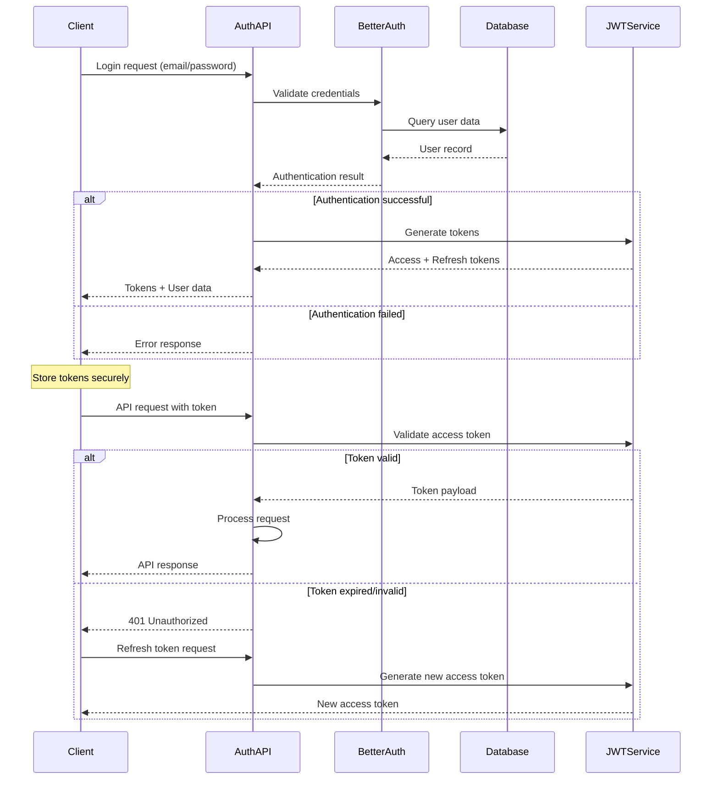

# 11. Backend Architecture

## Service Architecture

**Microservices with Serverless Functions:**

**Function Organization:**
```
api/
├── auth/
│   ├── login.ts        # POST /api/auth/login
│   ├── refresh.ts      # POST /api/auth/refresh
│   └── logout.ts       # POST /api/auth/logout
├── effects/
│   ├── list.ts         # GET /api/effects
│   ├── trigger.ts      # POST /api/effects/trigger
│   └── upload.ts       # POST /api/effects/upload
├── sessions/
│   ├── start.ts        # POST /api/sessions/start
│   ├── end.ts          # POST /api/sessions/end
│   └── status.ts       # GET /api/sessions/:id/status
├── brand-kit/
│   ├── create.ts       # POST /api/brand-kit
│   ├── update.ts       # PUT /api/brand-kit/:id
│   └── get.ts          # GET /api/brand-kit/:id
└── websocket/
    ├── connect.ts      # WebSocket connection handler
    └── handlers/       # Message type handlers
```

**Function Template:**
```typescript
// Standard serverless function structure
import { NextRequest, NextResponse } from 'next/server';
import { withAuth } from '@/middleware/auth';
import { withErrorHandling } from '@/middleware/errors';
import { z } from 'zod';

// Input validation schema
const RequestSchema = z.object({
  effectId: z.string(),
  sessionId: z.string(),
});

async function triggerEffectHandler(request: NextRequest) {
  // Parse and validate input
  const body = await request.json();
  const { effectId, sessionId } = RequestSchema.parse(body);
  
  // Business logic
  const effect = await EffectsService.getById(effectId);
  if (!effect) {
    return NextResponse.json(
      { error: 'Effect not found' },
      { status: 404 }
    );
  }
  
  // Process the effect trigger
  const activation = await EffectsService.trigger(effect, sessionId);
  
  return NextResponse.json(activation);
}

// Apply middleware and export
export const POST = withErrorHandling(withAuth(triggerEffectHandler));
```

## Database Architecture

**Convex Schema Design:**
```sql
-- Conceptual SQL representation of Convex schema
CREATE TABLE creators (
  id VARCHAR PRIMARY KEY,
  email VARCHAR UNIQUE NOT NULL,
  display_name VARCHAR NOT NULL,
  subscription_tier ENUM('free', 'creator', 'professional', 'enterprise'),
  settings JSONB,
  created_at TIMESTAMP DEFAULT NOW(),
  updated_at TIMESTAMP DEFAULT NOW()
);

CREATE INDEX idx_creators_email ON creators(email);

CREATE TABLE brand_kits (
  id VARCHAR PRIMARY KEY,
  creator_id VARCHAR REFERENCES creators(id),
  name VARCHAR NOT NULL,
  color_palette JSONB NOT NULL,
  typography JSONB NOT NULL,
  motion_intensity INTEGER CHECK (motion_intensity BETWEEN 1 AND 5),
  allowed_categories TEXT[]
);

CREATE TABLE stream_sessions (
  id VARCHAR PRIMARY KEY,
  creator_id VARCHAR REFERENCES creators(id),
  platform VARCHAR NOT NULL,
  status ENUM('active', 'paused', 'ended'),
  start_time TIMESTAMP NOT NULL,
  end_time TIMESTAMP,
  metrics JSONB
);

CREATE INDEX idx_sessions_creator ON stream_sessions(creator_id);
CREATE INDEX idx_sessions_status ON stream_sessions(status);
```

**Data Access Layer:**
```typescript
// Repository pattern for database operations
export class CreatorRepository {
  static async findByEmail(email: string): Promise<Creator | null> {
    return await db.query("creators")
      .filter(q => q.eq(q.field("email"), email))
      .first();
  }

  static async create(creatorData: Omit<Creator, "id">): Promise<Creator> {
    return await db.insert("creators", {
      ...creatorData,
      _creationTime: Date.now(),
    });
  }

  static async updateSettings(
    creatorId: string, 
    settings: Partial<CreatorSettings>
  ): Promise<void> {
    await db.patch(creatorId, { settings });
  }
}
```

## Authentication and Authorization

**Auth Flow:**


**Middleware/Guards:**
```typescript
// Authentication middleware
export function withAuth(handler: RequestHandler) {
  return async (request: NextRequest) => {
    try {
      const token = extractTokenFromHeader(request);
      const payload = await verifyJWT(token);
      const user = await CreatorRepository.findById(payload.userId);
      
      if (!user) {
        return new NextResponse('Unauthorized', { status: 401 });
      }
      
      // Add user to request context
      request.user = user;
      return handler(request);
      
    } catch (error) {
      return new NextResponse('Unauthorized', { status: 401 });
    }
  };
}

// Role-based authorization
export function withRole(requiredRole: SubscriptionTier) {
  return (handler: RequestHandler) => withAuth(async (request: NextRequest) => {
    const user = request.user;
    if (!hasRequiredRole(user.subscriptionTier, requiredRole)) {
      return new NextResponse('Forbidden', { status: 403 });
    }
    return handler(request);
  });
}
```

---
