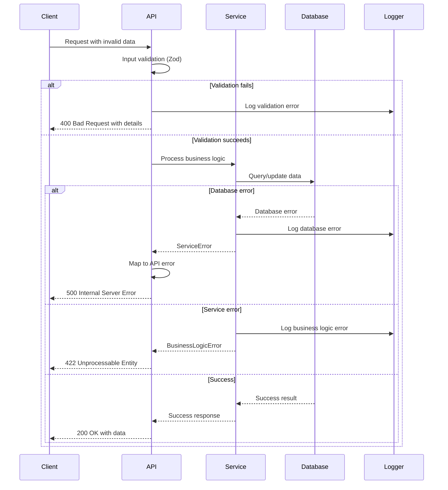

# 18. Error Handling Strategy

## Error Flow



## Error Response Format

```typescript
interface ApiError {
  error: {
    code: string;           // Machine-readable error code
    message: string;        // Human-readable error message
    details?: Record<string, any>; // Additional context
    timestamp: string;      // ISO timestamp
    requestId: string;      // Unique request identifier for tracking
    field?: string;         // Specific field for validation errors
  };
}

// Example error responses
{
  "error": {
    "code": "VALIDATION_ERROR",
    "message": "Invalid effect ID provided",
    "details": {
      "field": "effectId",
      "received": "invalid-uuid",
      "expected": "Valid UUID format"
    },
    "timestamp": "2025-09-06T10:30:00.000Z",
    "requestId": "req_abc123def456"
  }
}
```

## Frontend Error Handling

```typescript
// Global error boundary for React components
export class ErrorBoundary extends Component<Props, State> {
  constructor(props: Props) {
    super(props);
    this.state = { hasError: false, error: null };
  }

  static getDerivedStateFromError(error: Error): State {
    return { hasError: true, error };
  }

  componentDidCatch(error: Error, errorInfo: ErrorInfo) {
    // Log error to monitoring service
    logger.error('React error boundary caught error', {
      error: error.message,
      stack: error.stack,
      componentStack: errorInfo.componentStack,
    });
  }

  render() {
    if (this.state.hasError) {
      return (
        <ErrorFallback 
          error={this.state.error}
          onRetry={() => this.setState({ hasError: false, error: null })}
        />
      );
    }

    return this.props.children;
  }
}

// Service-level error handling
export class ApiService {
  private async handleApiResponse<T>(response: Response): Promise<T> {
    if (!response.ok) {
      const errorData = await response.json();
      
      // Create structured error
      const apiError = new ApiError(
        errorData.error.code,
        errorData.error.message,
        response.status,
        errorData.error.details
      );
      
      // Log error for debugging
      logger.error('API error', {
        status: response.status,
        code: errorData.error.code,
        message: errorData.error.message,
        requestId: errorData.error.requestId,
      });
      
      throw apiError;
    }
    
    return response.json();
  }
}
```

## Backend Error Handling

```typescript
// Centralized error handling middleware
export function withErrorHandling(handler: RequestHandler) {
  return async (request: NextRequest) => {
    try {
      return await handler(request);
    } catch (error) {
      const requestId = generateRequestId();
      
      // Log error with context
      logger.error('API handler error', {
        error: error.message,
        stack: error.stack,
        requestId,
        path: request.nextUrl.pathname,
        method: request.method,
        userAgent: request.headers.get('user-agent'),
      });
      
      // Map error to appropriate HTTP response
      if (error instanceof ValidationError) {
        return NextResponse.json(
          {
            error: {
              code: 'VALIDATION_ERROR',
              message: error.message,
              details: error.details,
              timestamp: new Date().toISOString(),
              requestId,
            },
          },
          { status: 400 }
        );
      }
      
      if (error instanceof BusinessLogicError) {
        return NextResponse.json(
          {
            error: {
              code: error.code,
              message: error.message,
              timestamp: new Date().toISOString(),
              requestId,
            },
          },
          { status: 422 }
        );
      }
      
      // Generic server error for unexpected errors
      return NextResponse.json(
        {
          error: {
            code: 'INTERNAL_SERVER_ERROR',
            message: 'An unexpected error occurred',
            timestamp: new Date().toISOString(),
            requestId,
          },
        },
        { status: 500 }
      );
    }
  };
}
```

---
