# 2. High Level Architecture

## Technical Summary

VibeLayerAI employs a **real-time, event-driven microservices architecture** with native mobile apps and web PWA frontend, utilizing Google Cloud AI services for sub-500ms conversation-aware effect suggestions. The system combines WebSocket-based real-time communication, distributed AI processing pipeline, and cross-platform rendering engines (WebGL/Metal/OpenGL) to deliver professional live streaming effects. The architecture prioritizes mobile-first user experience while maintaining desktop feature parity, leveraging Convex for real-time data synchronization and multi-region deployment for global scalability. This design achieves the critical performance targets while providing enterprise-grade security for audio processing and creator privacy.

## Platform and Infrastructure Choice

**Platform:** Multi-cloud with Vercel + Google Cloud + Convex
**Key Services:** 
- Vercel (Frontend hosting, Edge functions, CDN)
- Google Cloud (STT v2, Gemini 2.5 Flash, Cloud Run)
- Convex (Real-time database, WebSocket scaling)
- Doppler (Secret management)

**Deployment Host and Regions:** Multi-region (US-East, US-West, EU-West) with intelligent creator-to-region routing

**Rationale:** This hybrid approach optimizes for the specific requirements:
- Vercel provides optimal Next.js deployment and global CDN for web app
- Google Cloud required for exclusive AI stack (STT + Gemini) with regional optimization
- Convex handles real-time WebSocket scaling and data synchronization better than traditional databases
- Multi-region deployment essential for sub-500ms global latency targets

## Repository Structure

**Structure:** Monorepo with workspace-based organization
**Monorepo Tool:** pnpm workspaces + Turbo for build orchestration
**Package Organization:** 
- `apps/` - Deployable applications (control-panel, mobile-ios, mobile-android, api-services)
- `packages/` - Shared libraries (effects-engine, protocol, brand-kit, config, ui-components)
- Clear separation enables independent deployment while maximizing code reuse

## High Level Architecture Diagram

```mermaid
graph TB
    %% Users
    MobileUser[📱 Mobile Creator]
    WebUser[💻 Desktop Creator]
    
    %% Frontend Layer
    subgraph "Frontend Applications"
        MobileApp[Native Mobile App<br/>iOS/Android]
        WebApp[Web PWA<br/>Next.js + React]
    end
    
    %% API Gateway
    subgraph "API Layer"
        Gateway[API Gateway<br/>Vercel Edge Functions]
        WSHub[WebSocket Hub<br/>Node.js/Fastify]
    end
    
    %% Core Services
    subgraph "Backend Services"
        AgentOrch[Agent Orchestra<br/>LangGraph + PydanticAI]
        EffectEngine[Effects Engine<br/>Rendering Service]
        BrandService[Brand Kit Service]
        Analytics[Analytics Service]
    end
    
    %% AI Services
    subgraph "Google Cloud AI"
        STT[Speech-to-Text v2<br/>Streaming + Diarization]
        Gemini[Gemini 2.5 Flash<br/>Intent Classification]
    end
    
    %% Data Layer
    subgraph "Data & Storage"
        Convex[(Convex DB<br/>Real-time Sync)]
        FileStore[File Storage<br/>Google Cloud Storage]
        Cache[Redis Cache<br/>Effect Assets]
    end
    
    %% External Integrations
    subgraph "Streaming Platforms"
        TikTok[TikTok Live API]
        Twitch[Twitch API]
        YouTube[YouTube Live API]
    end
    
    %% Connections
    MobileUser --> MobileApp
    WebUser --> WebApp
    
    MobileApp --> Gateway
    MobileApp --> WSHub
    WebApp --> Gateway
    WebApp --> WSHub
    
    Gateway --> AgentOrch
    WSHub --> AgentOrch
    
    AgentOrch --> STT
    AgentOrch --> Gemini
    AgentOrch --> EffectEngine
    AgentOrch --> BrandService
    
    EffectEngine --> Cache
    BrandService --> Convex
    Analytics --> Convex
    
    AgentOrch --> FileStore
    
    MobileApp -.-> TikTok
    WebApp -.-> Twitch
    WebApp -.-> YouTube
```

## Architectural Patterns

- **Event-Driven Microservices:** Asynchronous processing enables real-time responsiveness while maintaining service isolation - _Rationale:_ Critical for sub-500ms latency targets and independent scaling of AI processing components

- **CQRS (Command Query Responsibility Segregation):** Separate read/write models for real-time suggestions vs historical analytics - _Rationale:_ Optimizes for both real-time performance and complex analytics queries

- **Agent-Based AI Orchestration:** LangGraph coordinates STT → Intent → Suggestion pipeline with intelligent fallbacks - _Rationale:_ Provides deterministic AI processing flow while enabling complex multi-step reasoning

- **Cross-Platform Shared Components:** TypeScript interfaces and business logic shared across web/mobile - _Rationale:_ Ensures consistency while allowing platform-specific optimizations

- **WebSocket-First Communication:** Real-time bidirectional communication for suggestions and status - _Rationale:_ Essential for conversation-aware effects that feel instant and natural

- **Progressive Web App (PWA) Pattern:** Web app installable with offline capabilities for reliability - _Rationale:_ Bridges native app experience with web deployment flexibility

- **Multi-Tenant Brand System:** Brand Kit configurations isolated per creator with inheritance - _Rationale:_ Enables white-label customization while maintaining performance

- **Circuit Breaker Pattern:** Graceful degradation when AI services experience latency spikes - _Rationale:_ Maintains user experience during service disruptions

---
