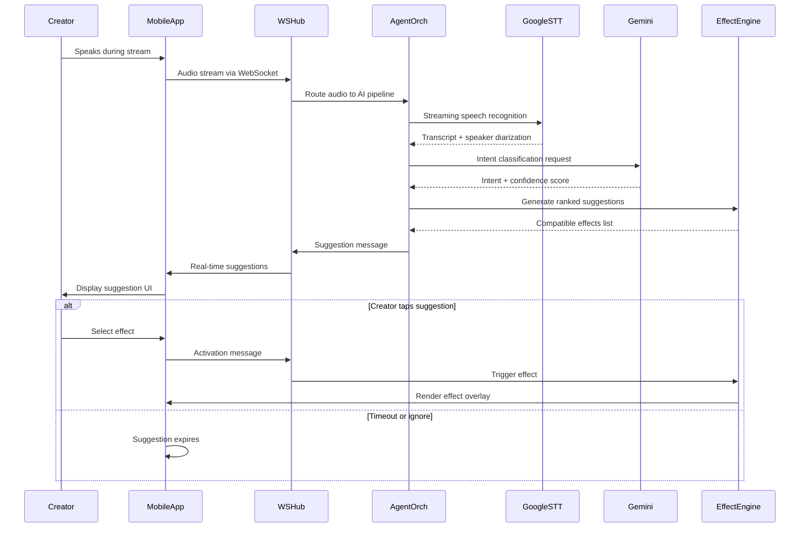
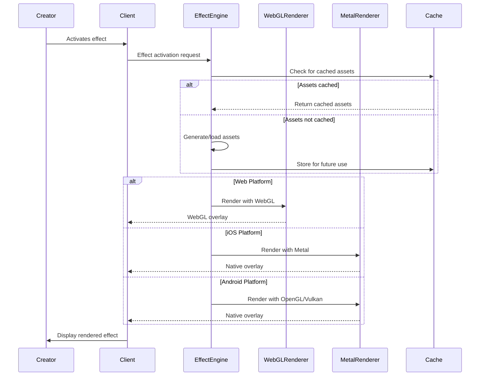

# 8. Core Workflows

## Real-Time Effect Suggestion Workflow

```mermaid
sequenceDiagram
    participant Creator
    participant MobileApp
    participant WSHub
    participant AgentOrch
    participant GoogleSTT
    participant Gemini
    participant EffectEngine

    Creator->>MobileApp: Speaks during stream
    MobileApp->>WSHub: Audio stream via WebSocket
    WSHub->>AgentOrch: Route audio to AI pipeline
    
    AgentOrch->>GoogleSTT: Streaming speech recognition
    GoogleSTT-->>AgentOrch: Transcript + speaker diarization
    
    AgentOrch->>Gemini: Intent classification request
    Gemini-->>AgentOrch: Intent + confidence score
    
    AgentOrch->>EffectEngine: Generate ranked suggestions
    EffectEngine-->>AgentOrch: Compatible effects list
    
    AgentOrch->>WSHub: Suggestion message
    WSHub->>MobileApp: Real-time suggestions
    MobileApp->>Creator: Display suggestion UI
    
    alt Creator taps suggestion
        Creator->>MobileApp: Select effect
        MobileApp->>WSHub: Activation message
        WSHub->>EffectEngine: Trigger effect
        EffectEngine->>MobileApp: Render effect overlay
    else Timeout or ignore
        MobileApp->>MobileApp: Suggestion expires
    end
```

## Cross-Platform Effect Rendering Workflow

```mermaid
sequenceDiagram
    participant Creator
    participant Client
    participant EffectEngine
    participant WebGLRenderer
    participant MetalRenderer
    participant Cache

    Creator->>Client: Activates effect
    Client->>EffectEngine: Effect activation request
    
    EffectEngine->>Cache: Check for cached assets
    alt Assets cached
        Cache-->>EffectEngine: Return cached assets
    else Assets not cached
        EffectEngine->>EffectEngine: Generate/load assets
        EffectEngine->>Cache: Store for future use
    end
    
    alt Web Platform
        EffectEngine->>WebGLRenderer: Render with WebGL
        WebGLRenderer-->>Client: WebGL overlay
    else iOS Platform  
        EffectEngine->>MetalRenderer: Render with Metal
        MetalRenderer-->>Client: Native overlay
    else Android Platform
        EffectEngine->>MetalRenderer: Render with OpenGL/Vulkan
        MetalRenderer-->>Client: Native overlay
    end
    
    Client->>Creator: Display rendered effect
```

---
